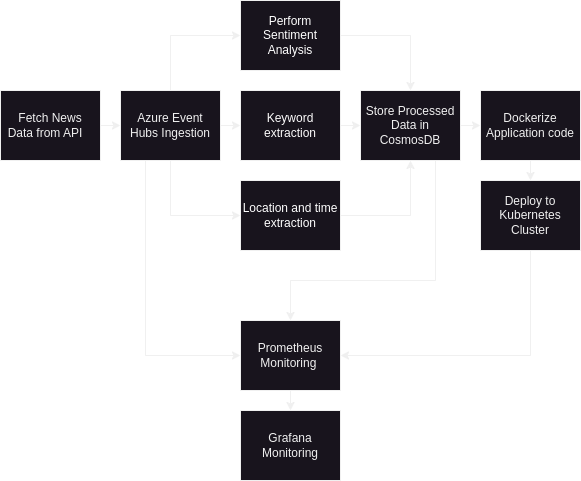

# Real-Time News Analytics

A real-time news analytics system that fetches data from a news API, performs sentiment analysis, extracts hashtags, and stores processed data in Azure Cosmos DB. The project runs on Kubernetes using Docker containers and integrates with Azure Event Hubs for data ingestion. Additionally, Prometheus and Grafana are used for monitoring and visualization.

## Table of Contents

- [Project Overview](#project-overview)
- [Features](#features)
- [Getting Started](#getting-started)
- [Configuration](#configuration)
- [Monitoring with Prometheus and Grafana](#monitoring-with-prometheus-and-grafana)

## Project Overview

This project aims to provide a real-time news analytics pipeline that continuously collects and processes news data, extracts relevant information, and stores it for further analysis. The processed data is ingested into Azure Cosmos DB, and the project is containerized using Docker and orchestrated using Kubernetes. The included Prometheus and Grafana integration enables monitoring and visualization of the system's performance.

## Workflow


## Features

- Fetch news data from a news API in real-time.
- Perform sentiment analysis on news articles.
- Extract relevant hashtags and keywords from articles.
- Store processed data in Azure Cosmos DB.
- Kubernetes deployment using Docker containers.
- Monitor application performance using Prometheus and visualize using Grafana.

## Getting Started

1. Clone the repository:

   ```bash
   git clone https://github.com/yourusername/real-time-news-analytics.git
   cd real-time-news-analytics
   ```
2. Setup Azure Event hubs, Azure CosmosDB and NewsAPI.

## Configuration

1. Run the setup script.sh which will 
    - Installs Minikube and Helm.
    - Installs Docker (assumes an APT-based Linux distribution).
    - Starts Minikube.
    - Installs Prometheus using Helm.
    - Installs Grafana using Helm.
    - Creates the config.json files with the provided JSON content in the data_ingestion/ and data_processing/ directories.

    ```bash
    sudo chmod +x setup.sh
    ./setup.sh
    ```
2. Fill in the configuration files and build the two dockerfiles in the directories data_ingestion/ and data_processing/.
    ```bash
    docker build data_ingestion/Dockerfile -t ingest_data:latest
    docker build data_processing/Dockerfile -t analyse_data:latest
    ```
3. Either push to dockerhub or push to minikube registry locally.
4. Run the minikube cluster, apply the news_injest_cronjob.yaml and news_analysis_store.yaml files.
    ```bash
    kubectl apply -f news_injest_cronjob.yaml
    kubectl apply -f news_analysis_store.yaml
    ```
5. Everything is done. Enjoy!

## Monitoring with Prometheus and Grafana
 - Additionally, some metrics like number of requests, number of positive sentiments, etc are exposed to prometheus. 
 - Just apply the prometheus_config.yaml file and check for the post in which Grafana is running.
    ```bash
    kubectl apply -f prometheus_config.yaml
    kubectl get pods --wide

    ```
 - use the hostname:port to access Grafana.
 - use promql queries to access prometheus data and add it to your custom dashboards. 
